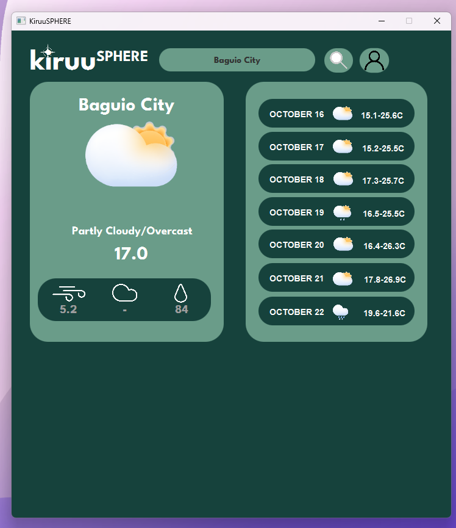
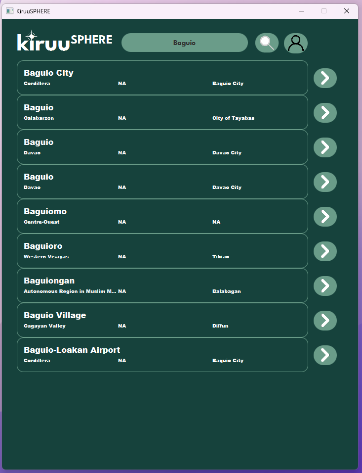
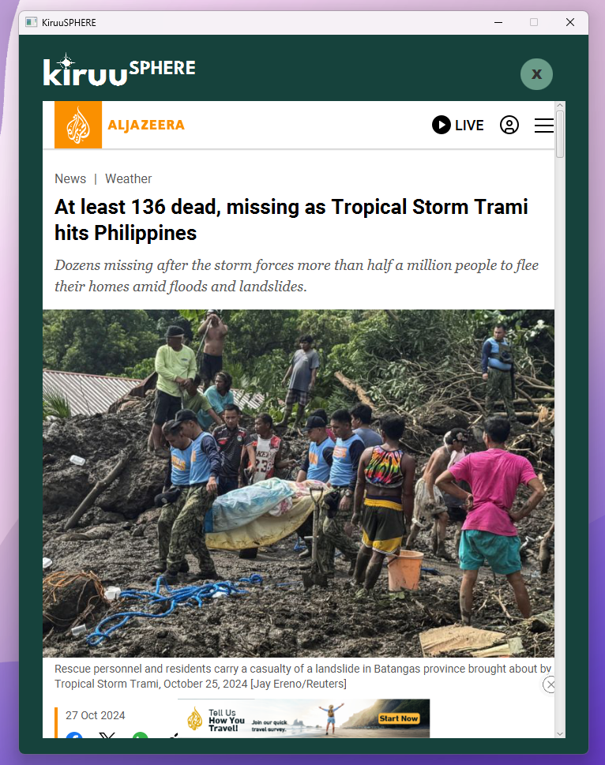

# KiruuSphere 🌐

### KiruuSphere is a simple and intuitive weather application built using JavaFX. It leverages the Open-Meteo Weather API to provide real-time weather updates and conditions for any location around the globe. With a user-friendly interface, it aims to help users stay updated with current weather and forecast information.

## Current Development UI
- Code refactoring in progress to optimize performance especially on WebView.
- A bug that prevents the app from being opened due to being unable to retrieve news data (which persists when there is no Internet connection), is to be resolved

## ✨ Features

- Real-Time Weather Updates: Get up-to-the-minute weather conditions, including temperature, humidity, wind speed, and more.
- Location Search: Search for weather updates by entering city names or coordinates.
- [Optional] Favorite Location: Save your preferred location to be automatically displayed each time the application starts.
- Forecasting: Provides future weather predictions based on selected locations.
- Air Quality Monitoring (Optional): Track air quality index and conditions if enabled.

### Before running this project, ensure you have the following:
- JDK 11 or above
- JavaFX SDK
- Internet Connection (For API requests)

## 🚧 Project Status

### The Currency Converter and this project are simultaneously being developed and maintained. Thus, development will be slower than usual.

