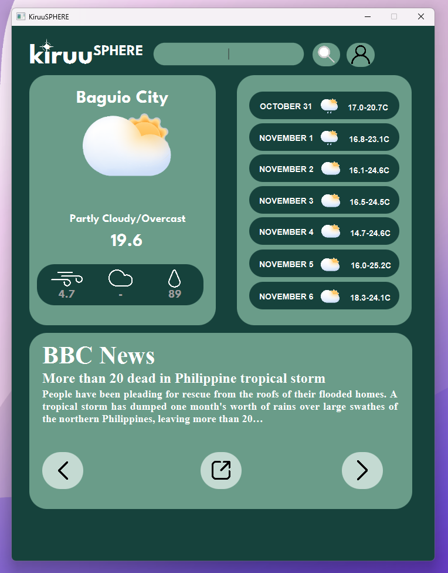

# KiruuSphere 🌐

### KiruuSphere is a simple and intuitive weather application built using JavaFX. It leverages the Open-Meteo Weather API to provide real-time weather updates and conditions for any location around the globe. With a user-friendly interface, it aims to help users stay updated with current weather and forecast information.

## Sample Current Development Design

- News API is utilized to provide latest weather updates in the locale
- Showing the articles in the bottom pane is under implementation

## ✨ Features

- Real-Time Weather Updates: Get up-to-the-minute weather conditions, including temperature, humidity, wind speed, and more.
- Location Search: Search for weather updates by entering city names or coordinates.
- [Optional] Favorite Location: Save your preferred location to be automatically displayed each time the application starts.
- Forecasting: Provides future weather predictions based on selected locations.

## 🚀 To-Be-Implemented

- Create a favorites system for users to save default locations.
- Add a detailed view for future weather predictions.

## ⚙️ Tech Stack

- JavaFX: For the graphical user interface.
- Open-Meteo API: For retrieving live weather data.
- Maven/Gradle: For project management and dependencies.

## 🛠️ Prerequisites

### Before running this project, ensure you have the following:
- JDK 11 or above
- JavaFX SDK
- Internet Connection (For API requests)

## 🚧 Project Status

## The Currency Converter and this project are simultaneously being developed and maintained. Thus, development will be slower than usual.
